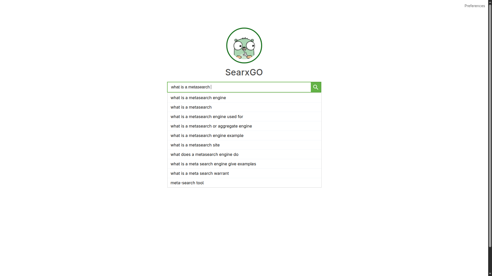
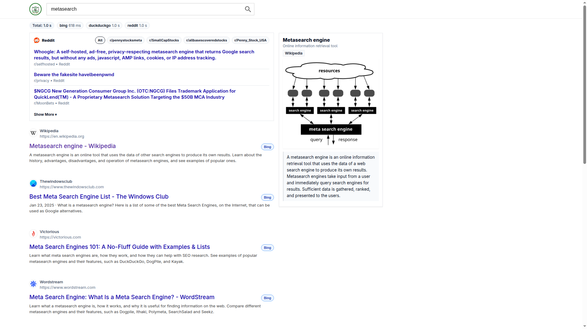

# SearxGO

Open metasearch engine written in Go which Aggregates results from multiple providers.


## Mockups 
some mockup screenshots of the app
### Autocomplete


### Results



## Quick start

```bash
# Run
go run .
# Open UI
# http://localhost:9000
```

## Build

```bash
go build -o searxgo
./searxgo
```

## Configure
Edit `config.toml`.

Key options:
- `server.port`: HTTP port (default 9000)
- `server.default_size`: results per page
- `engines.*.enabled`: toggle engines
- `engines.*.priority`: ranking order (lower = higher priority)

Toml Config:
```toml
[server]
port = 9000
default_size = 30

[engines.google]
enabled = true
priority = 1

[engines.bing]
enabled = true
priority = 3
```

## Endpoints
- Web UI: `/`
- Search (used by UI): `/search?q=<query>&page=<n>&size=<n>`

## Requirements
- Go 1.20+ (recommended)
